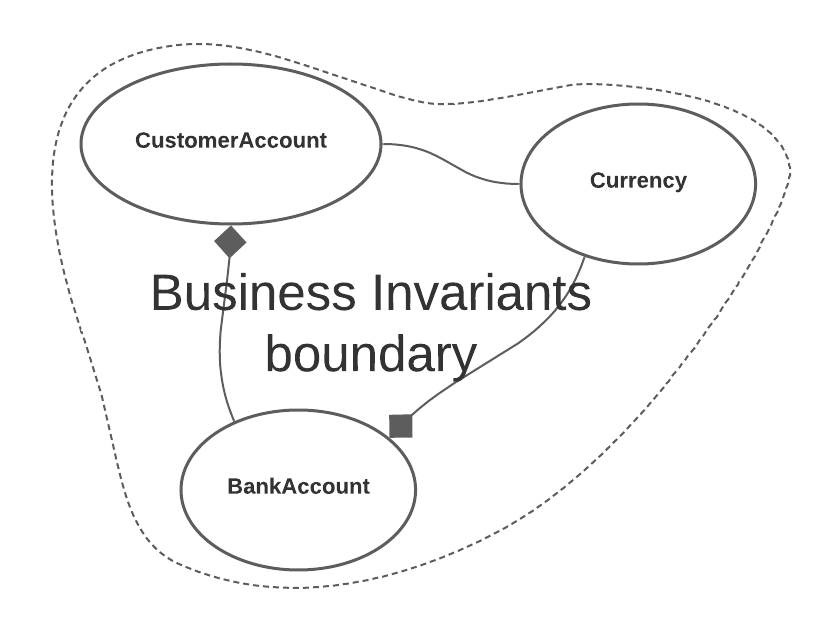
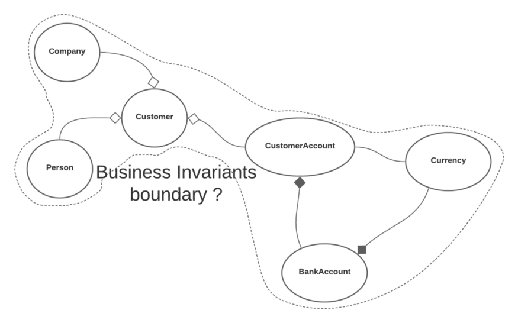
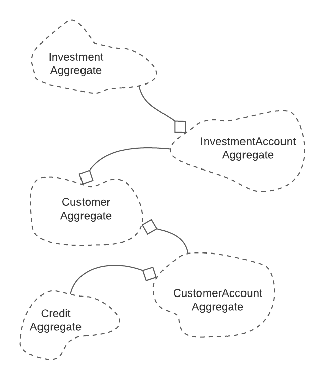

# DDD на практике в Golang: Агрегат


*Фото [Raphaël Biscaldi](https://unsplash.com/@les_photos_de_raph) из [Unsplash](https://unsplash.com/)*

Я потратил годы на понимание и практику DDD подхода. Большинство принципов было
легко понять и реализовать в коде. Тем не менее, один из них привлек мое особое
внимание.

Я должен сказать, что агрегат является наиболее важным шаблоном в DDD и 
вероятно вcё тактическое предметно-ориентированное проектирование не имеет 
смысла без него. Он нужен для объединения бизнес-логики.

При чтении, вы увидите, что Агрегат больше похож на набор шаблонов, но это
заблуждение. Агрегат — это ключевая точка уровня предметной области. Без него
нет причин использовать DDD.

> Другие статьи из DDD цикла:
> 1. [DDD на практике в Golang: Объект-значение](https://levelup.gitconnected.com/practical-ddd-in-golang-value-object-4fc97bcad70)
> 2. [DDD на практике в Golang: Сущности](https://levelup.gitconnected.com/practical-ddd-in-golang-entity-40d32bdad2a3)
> 3. [DDD на практике в Golang: Сервисы предметной области](https://levelup.gitconnected.com/practical-ddd-in-golang-domain-service-4418a1650274)
> 4. [Practical DDD in Golang: Domain Event](https://levelup.gitconnected.com/practical-ddd-in-golang-domain-event-de02ad492989)
> 5. [Practical DDD in Golang: Module](https://levelup.gitconnected.com/practical-ddd-in-golang-module-51edf4c319ec)

## Бизнес инварианты

В реальном мире некоторые правила гибки. Например, если вы берёте кредит в банке,
вам необходимо со временем выплачивать проценты. Общая сумма процентов регулируется
в зависимости от вашего инвестиционного капитала и периода, который вы потратите на
выплату долга.

В некоторых случаях банк может предоставить вам льготный период. Или предложение 
по кредиту будет более выгодным из-за вашей лояльности в прошлом. Или предоставить
вам уникальное одноразовое предложение, или заставить вас оформить ипотечный 
кредит на дом.

Все эти гибкие правила из реального мира, в DDD мы реализуем с помощью шаблона 
Policy (я расскажу о нём в следующих статьях). Они зависят от многих конкретных 
случаев и для реализации требуют более сложных структур кода.

> В реальном мире существуют незыблемые правила. Как бы мы не пытались, мы не 
> можем изменить ни их, ни то, как они используются в нашей бизнес-логике. Эти
> правила должны применяться всякий раз, когда объекты переходят из одного 
> состояния в другое. Их называют бизнес-инвариантами.
 
Например, никому не должно быть разрешено удалять учётную запись клиента в банке,
если на каком-либо из банковских счетов, связанных с клиентом, есть деньги или
задолженность.

Во многих банках один клиент может иметь несколько банковских счетов в одной и
той же валюте. Но в некоторых из них клиенту не разрешается иметь валюту в иностранной
валюте или иметь несколько счетов в одной и той же.

Когда возникают такие бизнес-правила, они становятся бизнес-инвариантами. Они 
существуют с момента создания объекта до его удаления. Их нарушение означает
нарушение назначения всего приложения.

```go
// Сущность
type Currency struct {
    id uuid.UUID
    //
    // какие-то поля
    //
}

func (c Currency) Equal(other Currency) bool {
    return c.id == other.id
}

// Сущность
type BankAccount struct {
    id       uuid.UUID
    iban     string
    amount   int
    currency Currency
}

func NewBankAccount(currency Currency) BankAccount {
    return BankAccount{
        //
        // определяем поля
        //
    }
}

func (ba BankAccount) HasMoney() bool {
    return ba.amount > 0
}

func (ba BankAccount) InDebt() bool {
    return ba.amount < 0
}

func (ba BankAccount) IsForCurrency(currency Currency) bool {
    return ba.currency.Equal(currency)
}

type BankAccounts []BankAccount

func (bas BankAccounts) HasMoney() bool {
    for _, ba := range bas {
        if ba.HasMoney() {
            return true
        }
    }

    return false
}

func (bas BankAccounts) InDebt() bool {
    for _, ba := range bas {
        if ba.InDebt() {
            return true
        }
    }

    return false
}

func (bas BankAccounts) HasCurrency(currency Currency) bool {
    for _, ba := range bas {
        if ba.IsForCurrency(currency) {
            return true
        }
    }

    return false
}


// Сущность и агрегат
type CustomerAccount struct {
    id        uuid.UUID
    isDeleted bool
    //
    // какие-то поля
    //
    accounts BankAccounts
    //
    // какие-то поля
    //
}

func (ca *CustomerAccount) MarkAsDeleted() error {
    if ca.accounts.HasMoney() {
        return errors.New("there are still money on bank account")
    }
    if ca.accounts.InDebt() {
        return errors.New("bank account is in debt")
    }

    ca.isDeleted = true

    return nil
}

func (ca *CustomerAccount) CreateAccountForCurrency(currency Currency) error {
    if ca.accounts.HasCurrency(currency) {
        return errors.New("there is already bank account for that currency")
    }
    ca.accounts = append(ca.accounts, NewBankAccount(currency))

    return nil
}
```
*Пример бизнес-инвариантов*

В вышеприведенном примере мы видим некую конструкцию кода в Go, 
`CustomerAccount`, которая является Сущностью и Агрегатом. Помимо этого созданы
Сущности `BankAccount` и `Currency`.

По отдельности у всех этих трех сущностей есть свои собственные бизнес-правила.
Некоторые из них гибкие, некоторые — инварианты. Тем не менее, когда они 
взаимодействуют, какие-то инварианты влияют на все. Для этого и создаётся 
агрегат.

У нас есть логика создания `BankAccount`, которая зависит от всех `BankAccounts`
конкретного `CustomerAccount`. В этом случае у одного Клиента не может быть 
несколько банковских счетов с одной и той же валютой.

Кроме того, мы не можем удалить `CustomerAccount`, если все подключенные к нему 
`BankAccount` не имеют ноль на счету. На них не должно быть денег и 
задолженностей.


*Область применения бизнес-инвариантов*

На диаграмме выше показан кластер из трёх уже обсуждавшихся сущностей. Все они 
вместе связаны с бизнес-инвариантами, которые гарантируют, что `Aggregate` 
всегда находится в правильном состоянии.

Если какая-либо другая Сущность или Объект-значение принадлежат тем же 
бизнес-инвариантам, то эти новые объекты становятся частью того же Агрегата.

Если в Агрегате у нас нет хотя бы одного инварианта, который связывает один объект
с остальными, то этот объект не принадлежит этому агрегату.

## Граница

Я много раз использовал DDD, и возникал вопрос, как определить границу Агрегата.
Этот вопрос всегда возникает при добавлении новой Сущности или Объекта-значения
в приложение.

Пока что понятно, что Агрегат - это не просто набор объектов. Это понятие 
предметной области. Его члены определяют логический кластер. Без группировки мы не
можем гарантировать, что они будут находиться в правильном состоянии.

```go
type Person struct {
    id uuid.UUID
    //
    // какие-то поля
    //
    birthday time.Time
}

type Company struct {
    id uuid.UUID
    //
    // какие-то поля
    //
    isLiquid bool
}

type Customer struct {
    id      uuid.UUID
    person  *Person
    company *Company
    //
    // какие-то поля
    //
}

func (c *Customer) IsLegal() bool {
    if c.person != nil {
        return c.person.birthday.AddDate(18, 0, 0).Before(time.Now())
    } else {
        return c.company.isLiquid
    }
}
```
*Агрегат Клиент*

В вышеприведенном фрагменте кода показан Агрегат Клиент (`Customer`). Не только 
здесь, но и во многих приложениях, у вас будут Сущности с названием Клиент 
(`Customer`) и почти всегда это будут Агрегаты.

Здесь у нас задано несколько бизнес-инвариантов, которые определяют легальность
конкретного Клиента (`Customer`), в зависимости от того говорим ли мы о 
человеке (`Person`) или компании (`Company`). Бизнес-инвариантов может быть 
даже больше, но пока достаточно одного.

Поскольку мы имеем дело с приложением для банка, проблема заключается в том, 
принадлежат ли `CustomerAccount` и `Customer` к одному и тому же Агрегату. Между
ними существует связь и некоторые бизнес-правила связывают их, но являются ли 
они инвариантами?


*Новые Сущности на уровне предметной области*

У одного Клиента (`Customer`) может быть множество `CustomerAccounts` (или ни 
одного). И мы видим, что существуют некие бизнес-инварианты для объектов рядом с 
`Customer` и объектов рядом c `CustomerAccounts`.

Исходя из точного определения инвариантов, если мы не можем найти ничего, 
что связывает вместе `Customer` и `CustomerAccount`, то мы должны разделить их 
на агрегаты. И любой другой кластер, который мы добавим на рисунок должен 
обрабатываться таким же образом — имеют ли он общие инварианты с уже 
существующими агрегатами?


*Несколько связанных агрегатов*

Хорошей практикой является делать агрегаты как можно меньше. Члены агрегата
сохраняются вместе в хранилище (например, базе данных) и добавление слишком
большого количества таблиц в одну транзакцию не является хорошей практикой.

Здесь мы уже видим, что должны определить репозиторий на уровне агрегата и
сохранять всех её членов только через этот репозиторий, как в примере ниже.

```go
type Customer struct {
    id      uuid.UUID
    person  *Person
    company *Company
    //
    // какие-то поля
    //
}
type CustomerRepository interface {
    Search(ctx context.Context, specification CustomerSpecification) ([]model.Customer, error)
    Create(ctx context.Context, customer model.Customer) (*model.Customer, error)
    UpdatePerson(ctx context.Context, customer model.Customer) (*model.Customer, error)
    UpdateCompany(ctx context.Context, customer model.Customer) (*model.Customer, error)
    //
    // и много других методов
    //
}
```
*Пример репозитория для всего агрегата*

Мы можем определить `Person` и `Company` как Сущности `Entities` (или Объекты-значения 
`Value Objects`), но даже если у них есть свой идентификатор, мы должны обновить
из `Customer`, используя `CustomerRepository`.

Работая напрямую с `Person` или `Company` или сохраняя их без `Customer` и 
других объектов может нарушить бизнес-инварианты. Мы хотим убедиться, что транзакции
выполняются вместе или, если необходимо, откатить все изменения.

Кроме сохранения, удаление Агрегата должно происходить одновременно. Это означает,
что удаляя Сущность Клиент (`Customer`) мы должны удалить также Сущности 
`Person` и `Company`. У них нет причин существовать отдельно.

Как видите, Агрегат не должен быть слишком маленьким или слишком большим. Он
должен быть точно ограничен бизнес-инвариантами. Все, что находится внутри 
этой границы, мы должны использовать вместе, а все, что находится за этой 
границей, принадлежит другим Агрегатам.

## Связи

Как было видно ранее в статье, между Агрегатами существуют связи. Они всегда 
должны быть прописаны в коде, но как можно проще.

Чтобы избежать сложных связей, прежде всего нужно избегать ссылок на Агрегаты, 
а использовать идентификаторы для связей — как во фрагменте кода, показанном 
ниже.

```go
type CustomerAccount struct {
    id uuid.UUID
    //
    // какие-то поля
    //
    customer Customer // неправильный способ - используется ссылка
    //
    // какие-то поля
    //
}

type CustomerAccount struct {
    id uuid.UUID
    //
    // какие-то поля
    //
    customerID uuid.UUID // правильный способ - используется идентификатор
    //
    // какие-то поля
    //
}
```
*Избегаем ссылок, используя идентификаторы*

Другая проблема может быть связана с направлением связей. Наилучший сценарий — 
это когда существует однонаправленная связь между ними, и мы избегаем любой 
двунаправленной.

Это непростой процесс для принятия решения, и он зависит от вариантов 
использования в нашем ограниченном контексте. Если мы пишем программное 
обеспечение для банкомата, где пользователь взаимодействует с `CustomerAccount`
с помощью дебетовой карты, тогда мы иногда будем получать доступ к `Customer`, 
указав его идентификатор в `CustomerAccount`.

В другом случае нашим Ограниченным контекстом может быть приложение, которое
управляет всеми `CustomerAccounts` одного `Customer`. Пользователи могут 
авторизоваться и управлять всеми банковскими счетами (`CustomerAccounts`). В
этом случае Клиент (`Customer`) должен хранить список идентификаторов, 
связанных с банковскими счетами (`CustomerAccounts`).

## Корневой агрегат

Все агрегаты в этой статье имеют те же имена, что и некоторые сущности, 
например, Сущность и Агрегат `Customer`. Эти уникальные сущности — Корневые 
агрегаты (`Aggregate Roots`) и основные объекты внутри Агрегатов.

Корневой агрегат (`Aggregate Root`) — это шлюз для доступа ко всем другим 
Сущностям, Объектам-значениям и Коллекциям внутри них. Мы не должны изменять 
члены Агрегата напрямую, а только через Корневой Агрегат (`Aggregate Root`).

Корневой агрегат предоставляет методы, которые описывают его поведение. Он 
должен определять способы доступа к атрибутам или объектам внутри него, а также
позволять изменять эти данные. Даже когда Корневой агрегат возвращает объект,
он должен возвращать только его копию.

```go
func (ca *CustomerAccount) GetIBANForCurrency(currency Currency) (string, error) {
	for _, account := range ca.accounts {
		if account.IsForCurrency(currency) {
			return account.iban, nil
		}
	}
	return "", errors.New("this account does not support this currency")
}

func (ca *CustomerAccount) MarkAsDeleted() error {
	if ca.accounts.HasMoney() {
		return errors.New("there are still money on bank account")
	}
	if ca.accounts.InDebt() {
		return errors.New("bank account is in debt")
	}

	ca.isDeleted = true

	return nil
}

func (ca *CustomerAccount) CreateAccountForCurrency(currency Currency) error {
	if ca.accounts.HasCurrency(currency) {
		return errors.New("there is already bank account for that currency")
	}
	ca.accounts = append(ca.accounts, NewBankAccount(currency))

	return nil
}

func (ca *CustomerAccount) AddMoney(amount int, currency Currency) error {
	if ca.isDeleted {
		return errors.New("account is deleted")
	}
	if ca.isLocked {
		return errors.New("account is locked")
	}

	return ca.accounts.AddMoney(amount, currency)
}
```
*Пример методов, описывающих поведение Агрегата*

Поскольку Агрегат состоит из множества Сущностей и Объектов-значений, внутри него
существуют различные идентификаторы. В таких случаях различают два типа 
идентификаторов.

Корневой Агрегат имеет глобальный идентификатор. Этот идентификатор уникален 
глобально и в приложении нет ещё одной Сущности с таким же идентификатором. Мы
можем ссылаться на идентификатор Корневого Агрегата извне Агрегата.

Все остальные Сущности внутри Агрегатов имеют локальные идентификаторы. Такие
идентификаторы уникальны только внутри Агрегатов, но вне их могут повторяться.
Только Агрегат содержит информацию о локальных идентификаторах, и мы не должны 
ссылаться на них вне Агрегата.

```go
type Person struct {
    id uuid.UUID // локальный идентификатор
    //
    // какие-то поля
    //
    birthday time.Time
}

type Company struct {
    id uuid.UUID // локальный идентификатор
    //
    // какие-то поля
    //
    isLiquid bool
}

type CustomerAccount struct {
    id uuid.UUID // глобальный идентификатор
    person  *Person
    company *Company
    //
    // какие-то поля
    //
}
```
*Глобальные и локальные идентификаторы*

## Заключение

Агрегат — это понятие предметной области, задаваемое бизнес-инвариантами.
Бизнес-инварианты определяют правила, которые должны выполняться в любой момент
приложения. Они представляют собой границу Агрегата.

Агрегаты должны сохраняться и удаляться вместе. Корневой агрегат — это шлюз, 
через который осуществляется доступ к другим членам Агрегата. Доступ к ним 
возможен только через Корневые Агрегаты.

> Другие статьи из DDD цикла:
> 1. [DDD на практике в Golang: Объект-значение](https://levelup.gitconnected.com/practical-ddd-in-golang-value-object-4fc97bcad70)
> 2. [DDD на практике в Golang: Сущности](https://levelup.gitconnected.com/practical-ddd-in-golang-entity-40d32bdad2a3)
> 3. [DDD на практике в Golang: Сервисы предметной области](https://levelup.gitconnected.com/practical-ddd-in-golang-domain-service-4418a1650274)
> 4. [Practical DDD in Golang: Domain Event](https://levelup.gitconnected.com/practical-ddd-in-golang-domain-event-de02ad492989)
> 5. [Practical DDD in Golang: Module](https://levelup.gitconnected.com/practical-ddd-in-golang-module-51edf4c319ec)

## Полезные ссылки на источники:

* [https://martinfowler.com/](https://martinfowler.com/)
* [https://www.domainlanguage.com/](https://www.domainlanguage.com/)