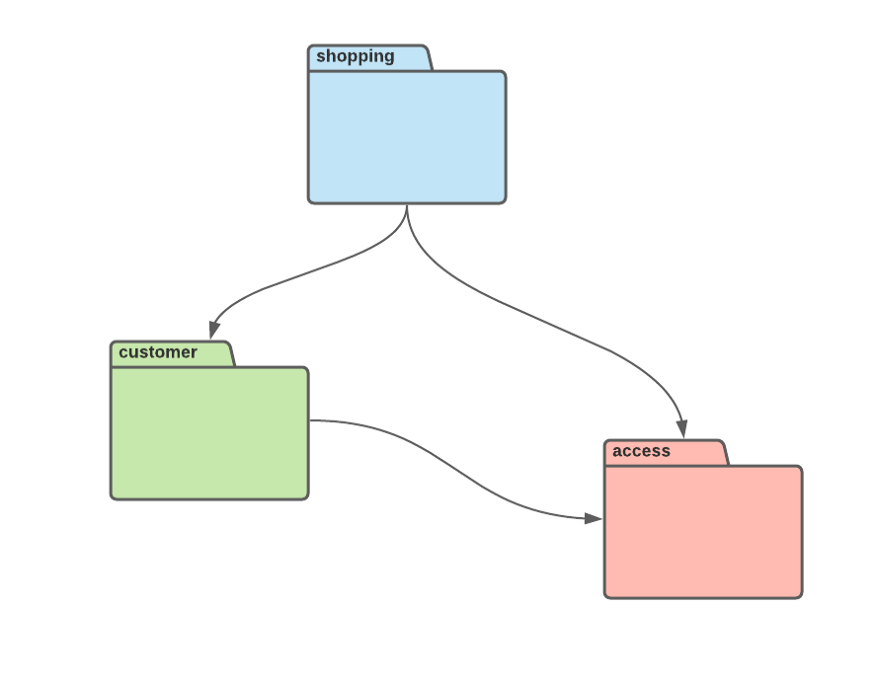

# DDD на практике в Golang: Модуль


*Фото [Amos Bar-Zeev](https://unsplash.com/@amosbarzeev) из [Unsplash](https://unsplash.com/)*

На первый взгляд Модуль не похож на шаблон, по крайней мере, на то, что мы 
считаем шаблоном при разработке программного обеспечения. С этим можно 
согласиться, поскольку кто-то больше воспринимает модуль как часть структуры
проекта, а не шаблон.

Дополнительные проблемы возникают, когда мы рассматриваем Go модули. Они включают
в себя коллекции Go пакетов, используют систему версий и релизов. Мы используем
эти модули для управления зависимостями в Go.

Итак, если Go модули и пакеты влияют на структуру проекта, кажется, что они 
должны как-то быть связаны с шаблоном Модуль (`Module`) в DDD. В действительности
так и есть.

> Другие статьи из DDD цикла:
> 1. [DDD на практике в Golang: Объект-значение](https://levelup.gitconnected.com/practical-ddd-in-golang-value-object-4fc97bcad70)
> 2. [DDD на практике в Golang: Сущности](https://levelup.gitconnected.com/practical-ddd-in-golang-entity-40d32bdad2a3)
> 3. [DDD на практике в Golang: Сервисы предметной области](https://levelup.gitconnected.com/practical-ddd-in-golang-domain-service-4418a1650274)
> 4. [Practical DDD in Golang: Domain Event](https://levelup.gitconnected.com/practical-ddd-in-golang-domain-event-de02ad492989)

## Структура

В Go мы используем пакеты для группировки нашего кода. Пакеты соответствуют 
структуре папок внутри наших проектов, хотя могут иметь различные названия.
Эти различия возникают потому, что мы можем назвать наш пакет иначе, чем 
папку.

```go
// папка pkg/access/domain/model
package access_model

import (
    "github.com/google/uuid"
)

type User struct {
    ID uuid.UUID
    // 
    // какие-то поля
    // 
}

// папка pkg/access/domain/service
package access_service

import (
    "project/pkg/access/domain/model"
)

type UserService interface {
	Create(user access_model.User) error
	//
	// какие-то методы
	//
}
```
*Разница между названием папки и названием пакета*

В вышеприведенном примере видны небольшие отличия в именовании папок и пакетов.
Иногда, если у меня много пакетов с моделями, я добавляю им префиксы моих DDD
модулей, чтобы было легче ссылаться на несколько моделей в одном файле.

Теперь мы скорее всего уже имеете некоторое представление о том, что являлось бы
DDD модулем в предыдущем примере. Там Модуль (`Module`) - это папка access со 
всеми его дочерними пакетами.

```shell
project
|--cmd
   |--main.go
|--internal
   |--module1
      |--infrastructure
      |--presentation
      |--application
      |--domain     
         |--service    
         |--factory    
         |--repository    
         |--model  
      |--module1.go
   |--module2
      |--...
   |--...
|--pkg
   |--module3
      |--...
   |--module4
      |--...
   |--...
|--go.mod
|--...
```

Структура папок из вышеприведенной схемы является моей любимой структурой 
проекта, реализующего предметно-ориентированное проектирование в Go. Иногда
я вношу изменения в некоторые папки, но всегда стараюсь сохранять DDD модули
в одной и той же форме.

В моих проектах каждый модуль имеет максимум четыре базовых пакета: 
`infrastructure`, `presentation`, `application` и `domain`. Как видите, мне 
нравится следовать принципам [многоуровневой архитектуры](https://www.oreilly.com/library/view/software-architecture-patterns/9781491971437/ch01.html).

Здесь я поместил пакет `infrastructure` в самом вверху. Это связано с тем, что 
следуя [принципу инверсии зависимостей](https://stackify.com/dependency-inversion-principle/) [Дяди Боба](https://twitter.com/unclebobmartin)
мои низкоуровневые сервисы из инфраструктурного уровня реализуют высокоуровневые
интерфейсы других уровней.

При таком подходе я определяю `Port` как интерфейс `UserRepository`
на уровне предметной области. Фактическая реализация находится на 
инфраструктурном уровне и ей могут соответствовать несколько адаптеров, 
например, `UserDBRepository` или `UserFakeRepository`.

```go
// папка pkg/access/domain/repository
package access_repository

import access_model "github.com/MaksimDzhangirov/PracticalDDD/pkg/access/domain/model"

type UserRepository interface {
    Create(user access_model.User) error
}

package database

type UserDBRepository struct {
    //
    // какие-то поля
    //
}

func (r *UserDBRepository) Create(user access_model.User) error {
    //
    // какие-то код
    //
    return nil
}

package fake

type UserFakeRepository struct {
    //
    // какие-то поля
    //
}

func (r *UserFakeRepository) Create(user access_model.User) error {
    //
    // какие-то код
    //
    return nil
}
```
*Порты и Адаптеры*

Понятия "Портов" и "Адаптеров" не является чем-то новым и относятся к принципам
[гексагональной архитектуры](https://medium.com/ssense-tech/hexagonal-architecture-there-are-always-two-sides-to-every-story-bc0780ed7d9c) (`Hexagonal Architecture`).
Это второй принцип, который я использую при разработке своих DDD модулей и для
меня он является решающим.

Возвращаясь к структуре пакетов внутри модуля, каждый уровень знает всё о 
нижестоящих, и никто ничего не знает о них вне модуля. Таким образом, уровень
`infrastructure` может зависеть от всех уровней, а уровень `domain` не зависит
ни от одного.

Сразу за инфраструктурным уровнем находится уровень представления. Мы также 
могли называть это уровень `interface`, но это зарезервированное слово в Go, 
поэтому будем использовать `presentation`. Наконец между уровнями `presentation`
и `domain` находится `application`.

Преимущество использования таких уровней в Go заключается в том, что это 
помогает нам избежать циклических зависимостей, которые не позволяют скомпилировать
наш код. Используя эти уровни и направление зависимостей, мы можем избавиться от 
болезненного рефакторинга кода.

Наконец, наверное вы заметили, что некоторые папки (или пакеты) внутри уровня
`domain` называются: `model`, `service` и т.д. Я иногда добавляю их, чтобы мои 
пакеты были как можно проще.

Иногда я использую эту внутреннюю подструктуру, чтобы избежать циклических 
зависимостей в Go. Я предпочитаю, когда папка `model` находится в самом низу, а
`service` вверху, но каждый может выбирать как ему нравится.

## Логический кластер

DDD модуль — это не просто группа файлов и папок расположенных вместе. Код внутри
этих файлов и папок должен представлять некую связанную конструкцию. И кроме того,
два разных Модуля (`Modules`) должны быть слабо связаны, с минимальными 
зависимостями между ними.

```
project
|--...
|--pkg
   |--access
      |--infrastructure
         |--...
      |--presentation
         |--...
      |--application
         |--service
            |--authorization.go
            |--registration.go
      |--domain     
         |--repository
            |--user.go
            |--group.go
            |--role.go    
         |--model
            |--user.go
            |--group.go
            |--role.go
      |--access.go
   |--shopping
      |--infrastructure
         |--...
      |--presentation
         |--...
      |--application
         |--service
            |--session_basket.go
      |--domain     
         |--service 
            |--shopping.go 
         |--factory 
            |--basket.go 
         |--repository
            |--order.go   
         |--model
            |--order.go
            |--basket.go
      |--shopping.go
   |--customer
      |--infrastructure
         |--...
      |--presentation
         |--...
      |--application
         |--...
      |--domain 
         |--repository
            |--customer.go 
            |--address.go    
         |--model
            |--customer.go 
            |--address.go 
      |--customer.go
   |--...
|--...
```

Вышеприведенная структура — это простой пример использования DDD модулей. Здесь
у нас три модуля (их может быть и больше), названных `access`, `shopping` и
`customer`.

Модуль `access` связан с процессом авторизации и регистрации. Он содержит всю 
логику работы с пользователем (`User`) во время одной сессии. Кроме того в нём
хранятся права доступа каждого из них и он решает — могут ли они получить доступ 
к конкретному объекту.

Модуль `customer` содержит информацию о Клиентах `Customers` и их адресах 
`Addresses`. Хотя они могут быть похожи на `User`, он представляет Сущность,
осуществляющую Заказы (`Orders`), тогда как `User` - это Сущность для работы с
сессиями. Кроме того у одного и того же пользователя может быть множество 
адресов доставки, как мы уже видели на различных платформах.

Наконец, модуль `shopping` представляет собой кластер, хранящий всю логику,
включая создание корзины, хранение её в сессии, а также дальнейшее создание 
заказов. Этот модуль `shopping` выглядит более сложным, чем два других, и, 
действительно, зависит от них.

Как и в случае со слоями мы также должны отслеживать зависимости между модулями
и следить за тем, чтобы они были однонаправленными. Иначе компилятор выдаст 
ошибку.


*Диаграмма зависимостей модулей*

Как показано на рисунке выше, Модуль `shopping` использует Модуль `customer`,
чтобы узнать, кому принадлежит заказ. Из него он может извлечь адрес (`Address`)
доставки. Он также зависит от модуля `access`, для проверки прав доступа к 
определенным корзинам (`Baskets`) и её составляющим (`Items`).

Модуль `customer` зависит только от модуля `access`. Он обеспечивает связь с 
`User` в сессии, а также содержит список Клиентов (`Customers`), позволяя 
определить кому отправить Заказ (`Order`).

`customer` и `shopping` могут вместе определять один [ограниченный контекст](https://martinfowler.com/bliki/BoundedContext.html). 
Отдельный модуль необязательно должен представлять один ограниченный контекст.
Я люблю разбивать один ограниченный контекст на несколько Модулей.

Модуль `access` выглядит как кандидат для другого ограниченного контекста и в 
будущем мы можем подумать о его размещении в другом месте. Позднее другие 
ограниченные контексты могут зависеть от ограниченного контекста `access`.

Хотя может показаться, что `shopping` и `customer` можно объединить, в нашем
приложении мы решили разделить их. Причина в том, что Клиент (`Customer`) может осуществлять
другие различные операции, независимые от Заказов (`Orders`).

Мы можем менять адреса (`Addresses`), просматривать нашу историю покупок, отслеживать доставку,
связываться со службой поддержки. Изменения в реквизитах клиента не должны влиять
на те, что указаны в Заказе (`Order`). Также изменения адреса в каком-то Заказе 
(`Order`) не влияют на Клиента (`Customer`). Мы можем независимо работать с ними.

## Наименование

Может показаться странным говорить о наименовании, но к сожалению это не так. 
Основываясь на моём опыте, я видел ужасные названия для DDD модулей и сам создавал 
даже ещё хуже.

```
project
|--...
|--pkg
   |--shoppingAndCustomer
      |--...
   |--utils
      |--...
   |--events
      |--...
   |--strategy
      |--...
   |--...
|--...
```

В приведенном выше примере много плохих наименований. Я всегда избегаю использования
слова "and" в названиях модуля, например, как здесь, `shoppingAndCustomer`. 
Если невозможно не использовать слова "and", я имею дело с двумя отдельными 
Модулями.

Слово "utils" - худшее название при разработке программного обеспечения. Я не могу
его терпеть ни в названии структуры, ни в названии файла, ни в названии функции,
ни в названии пакета, ни в названии модуля. Имя "Сборщик мусора" вероятно подходит
наилучшим образом, поскольку лучше всего описывает весь код, хранящийся в 
модуле `utils`.

Также бесполезно иметь модуль, который бы содержал мелкие детали со всего 
приложения. Таким примером может быть Модуль `events` - он содержит События 
предметной области всего приложения.

Также не рекомендуется называть Модуль как какой-то шаблон проектирования, 
например, Модуль `strategy`. Вероятно нам следует использовать шаблон Стратегия
во многих местах нашего приложения, поэтому нет смысла создавать несколько 
Модулей `strategy`.

Наши модули должны заимствовать названия из реального мира. Название должно 
быть частью [Единого Языка](https://martinfowler.com/bliki/UbiquitousLanguage.html),
каким-то термином, который относится к реальному миру и разработке программного 
обеспечения, описывая одно и то же. Это должно быть уникальное имя для данного
кластера бизнес-логики.

## Внедрение зависимостей

Возможно вы заметили, что первая структура содержала отдельные Go файлы в корне
каждого DDD Модуля. Я всегда называю их `module.go` или по названию Модуля.

В этих файлах я определяю зависимости в моём Модуле и различных Адаптерах для 
своих Портов, если они есть. Во многих случаях я пишу простые Go контейнеры,
в которых хранятся объекты, используемые в приложении.

```go
package access

type AccessModule struct {
    repository access_repository.UserRepository
    service    access_service.UserService
}

func NewAccessModule(useDatabase bool) *AccessModule {
    var repository access_repository.UserRepository
    if useDatabase {
        repository = &database.UserDBRepository{}
    } else {
        repository = &fake.UserFakeRepository{}
    }
    var service access_service.UserService
    //
    // какой-то код
    //
    return &AccessModule{
        repository: repository,
        service:    service,
    }
}

func (m *AccessModule) GetRepository() access_repository.UserRepository {
    return m.repository
}

func (m *AccessModule) GetService() access_service.UserService {
    return m.service
}
```
*Простой Модуль с зависимостями*

В вышеприведенном примере я создал структуру `AccessModule`. Во время 
инициализации она принимает на вход конфигурацию, которая определяет должен ли
он использовать `UserRepository`, работающий с базой данных или с какой-то
её имитацией. Позже все другие модули могут использовать этот контейнер для
получения своих зависимостей.

Мы также можем реализовать внедрение зависимостей в Go, используя один из множества
имеющихся у нас фреймворков. Одна из наиболее часто используемых — это библиотека
[Wire](https://github.com/google/wire), но я сам предпочитаю [Dingo](https://github.com/i-love-flamingo/dingo).

Библиотека Dingo использует рефлексии, что является болезненной темой для многих
Go разработчиков. Хотя [я не поклонник рефлексий в Go](https://medium.com/codex/what-is-the-right-amount-of-reflection-in-golang-2c35d4fca68b),
по моему опыту, Dingo оказалась простым и стабильным решением, предоставляющим 
множество различных функций.

```go
package example

import "flamingo.me/dingo"

type BillingModule struct {}

func (module *BillingModule) Configure(injector *dingo.Injector) {
    // Эта команда сообщает Dingo, что всякий раз, когда она видит зависимость от TransactionLog
    // она должна удовлетворить её, используя DatabaseTransactionLog.
    injector.Bind(new(TransactionLog)).To(DatabaseTransactionLog{})
    
    // По аналогии такая запись сообщает Dingo, что когда используется CreditCardProcessor в зависимости,
    // она должна быть удовлетворена с помощью PaypalCreditCardProcessor.
    injector.Bind(new(CreditCardProcessor)).To(PaypalCreditCardProcessor{})
}
```

## Заключение

DDD модуль — это логический кластер для нашего кода. Он объединяет множество 
структур в связанную группу, которая разделяет некие бизнес-правила. Внутри 
модуля мы можем создавать разные уровни.

И уровни, и модули должны поддерживать однонаправленную связь, чтобы избежать
циклических зависимостей. Модули должны иметь имени, представляющие терминологию
из реального мира.

> Другие статьи из DDD цикла:
> 1. [DDD на практике в Golang: Объект-значение](https://levelup.gitconnected.com/practical-ddd-in-golang-value-object-4fc97bcad70)
> 2. [DDD на практике в Golang: Сущности](https://levelup.gitconnected.com/practical-ddd-in-golang-entity-40d32bdad2a3)
> 3. [DDD на практике в Golang: Сервисы предметной области](https://levelup.gitconnected.com/practical-ddd-in-golang-domain-service-4418a1650274)
> 4. [Practical DDD in Golang: Domain Event](https://levelup.gitconnected.com/practical-ddd-in-golang-domain-event-de02ad492989)


## Полезные ссылки на источники:

* [https://martinfowler.com/](https://martinfowler.com/)
* [https://www.domainlanguage.com/](https://www.domainlanguage.com/)