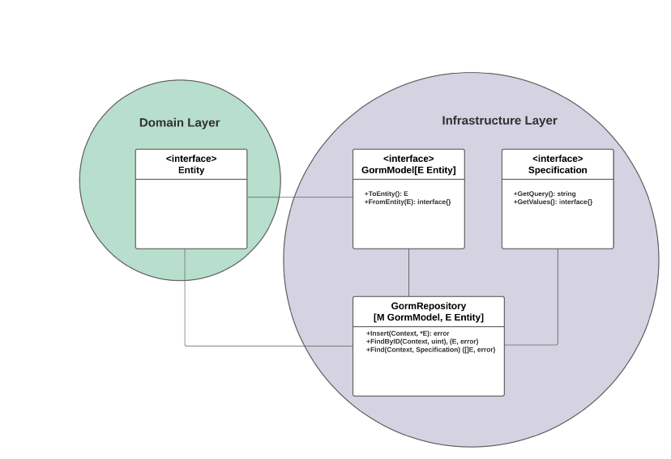

# Преимущества дженериков (Generics) в Go: шаблон Репозиторий для GORM

Можем ли мы ожидать, появление в Go полноценной структуры ORM и DBAL, такой 
как Doctrine?


*Фото [Rajan Alwan](https://unsplash.com/@rajanalwan) из [Unsplash](https://unsplash.com/)*

После месяцев и лет дискуссий, реализаций и проверки работоспособности мы
наконец достигли точки, когда произошла [революция](https://levelup.gitconnected.com/generics-in-go-viva-la-revolution-e27898bf5495)
в выбранном нами языке программирования. Вышла новая версия Golang [1.18](https://go.dev/blog/go1.18).

> Мы уже знали, что это будет радикальным изменением в кодовой базе Go,
> ещё до окончательного релиза Дженериков (Generics).

В течение многих лет мы использовали генераторы кода в Go всякий раз, когда 
хотели обеспечить некоторую универсальность и абстракцию. Познание 
концепции *"The Golang Way"* для многих из нас не было легким, но несмотря
на это привело к большим успехам. Это стоило того.

Теперь за столом появились новые игроки. Возникло много новых [пакетов](https://cs.opensource.google/go/x/exp/+/master:slices/slices.go), 
давшие нам некоторое представление о том, как мы можем обогатить 
экосистему Go повторно используемым кодом, который облегчил бы жизнь всем нам.
И что-то подобное послужило моим вдохновением, которое привело меня к 
небольшой **проверки работоспособности** концепции на основе [библиотеки GORM](https://gorm.io/index.html).
А теперь давайте посмотрим на неё.

## Исходный код

*Когда я писал эту статью она основывалась на [Git репозитории на GitHub](https://github.com/Ompluscator/gorm-generics). Код
(библиотека на Go) был проверки работоспособности концепции и я намеревался 
работать над ним дальше. Тем не менее он не был готов к использованию в 
продакшене (и я точно не планировал оказывать какую-либо продакшен 
поддержку на тот момент).*

Вы можете увидеть текущий функционал по [ссылке](https://github.com/Ompluscator/gorm-generics#example),
простейший пример использования показан во фрагменте кода ниже:

```go
package main

import (
	"context"
	"fmt"

	"gorm.io/gorm"

	"github.com/ompluscator/gorm-generics"
	// какие-то импорты
)

// Product - сущность предметной области
type Product struct {
	// какие-то поля
}

// ProductGorm - это DTO для сопоставления сущности Product с базой данных
type ProductGorm struct {
	// какие-то поля
}

// ToEntity соответствует интерфейсу gorm_generics.GormModel
func (g ProductGorm) ToEntity() Product {
	return Product{
		// какие-то поля
	}
}

// FromEntity соответствует интерфейсу gorm_generics.GormModel
func (g ProductGorm) FromEntity(product Product) interface{} {
	return ProductGorm{
		// какие-то поля
	}
}

func main() {
	db, err := gorm.Open( /* строка подключения к БД */ )
	// обработка ошибки

	err = db.AutoMigrate(ProductGorm{})
	// обработка ошибки

	// инициализируем новый репозиторий, передавая
	// GORM модель и сущность как тип
	repository := gorm_generics.NewRepository[ProductGorm, Product](db)

	ctx := context.Background()

	// создаём новую сущность
	product := Product{
		// какие-то поля
	}

	// посылаем новую сущность в репозиторий для сохранения
	err = repository.Insert(ctx, &product)
	// обработка ошибки

	fmt.Println(product)
	// Выводит:
	// {1 product1 100 true}

	single, err := repository.FindByID(ctx, product.ID)
	// обработка ошибки

	fmt.Println(single)
	// Выводит:
	// {1 product1 100 true}
}
```
Фрагмент кода с практическим примером из библиотеки, проверяющей 
работоспособность концепции

## Почему я выбрал ORM в качестве проверки работоспособности концепции

Как разработчик программного обеспечения с опытом, работавший со 
старомодными объектно-ориентированными языками программирования, такими как
Java, C# и PHP, одним из первых моих запросов в Google был какой-нибудь
подходящий ORM для Golang. Я был глуп и наивен, но ожидал, что найду её.

Дело не в том, что я не могу жить без ORM. Мне не особо нравится, как в коде 
выглядят чистые MySQL запросы. Вся эта конкатенация строк на мой взгляд
выглядит уродливо.

С другой стороны, мне всегда нравится сразу же приступать к написанию 
бизнес-логики, и я почти не трачу время на размышления об используемом 
хранилище. Иногда во время внедрения я меняю своё мнение и перехожу к 
другому типу хранилища. И именно в этом случае ORM облегчают переход.

Короче говоря, ORM позволяют:

1. сделать код чище
2. добавляют гибкости при выборе типы используемого хранилища
3. позволяют сфокусироваться на бизнес-логике, а не на технических деталях

В Golang существуют различные [решения](https://github.com/d-tsuji/awesome-go-orms) 
для ORM, и я использовал большинство из них. Неудивительно, что GORM — это 
то, которое я использовал чаще всего, поскольку оно покрывает большую часть 
необходимого функционала. Да, в нем отсутствуют некоторые известные шаблоны, 
такие как [Identity Map](https://www.martinfowler.com/eaaCatalog/identityMap.html), 
[Unit of Work](https://martinfowler.com/eaaCatalog/unitOfWork.html) и 
[Lazy Load](https://www.martinfowler.com/eaaCatalog/lazyLoad.html), но я 
мог бы жить и без них.

Но мне не хватало шаблона [Репозиторий](https://martinfowler.com/eaaCatalog/repository.html),
поскольку время от времени я сталкивался с дублированием похожих или 
идентичных блоков кода (и я ненавижу повторяться).

[DDD на практике в Golang: Репозиторий](repository.md)

Для этой цели я иногда использовал библиотеку [GNORM](https://gnorm.org/), 
шаблонизатор которой позволял мне создавать структуры Репозиториев. Хотя мне 
нравилась идея, которую предоставляет GNORM (хороший пример Golang Way!), 
постоянные обновления шаблонов для добавления нового функционала в 
репозиторий - это не очень хорошо.

Я попытался создать свою реализацию, которая основывается на рефлексии и 
поделиться ей с сообществом открытого исходного кода. Это было моей большой
ошибкой. Она работала, но поддерживать библиотеку было очень сложно и 
производительность была далека от хорошей. В конце концов я удалил Git 
репозиторий с GitHub.

И в тот самый момент, когда я уже отчаялся реализовать этот ORM апгрейд 
в Go, появились дженерики. *О, Боже. О, Боже!* Я сражу же вернулся к 
написанию кода.

## Реализация

У меня есть опыт в предметно-ориентированном проектировании. Это значит, что
мне нравится отделять уровень предметной области от инфраструктурного. Некоторые
ORM рассматривают шаблон Entity больше как [Шлюз записи данных](https://www.martinfowler.com/eaaCatalog/rowDataGateway.html) или 
[Active Record](https://www.martinfowler.com/eaaCatalog/activeRecord.html). Но поскольку как следует из названия он ссылается на 
шаблон Entity из DDD, происходит потеря при переходе и мы пытаемся хранить
бизнес-логику и технические детали в одном классе. И создаём монстра.

[DDD на практике в Golang: Сущности](entity.md)

> *Шаблон Entity не имеет ничего общего с сопоставлением схемы таблиц 
> базы данных. Это никак не связано с используемым хранилищем.*

Итак, я всегда использую Entity на уровне предметной области и [Data 
Transfer Object](https://www.martinfowler.com/eaaCatalog/dataTransferObject.html) 
в инфраструктурном. Сигнатуры моих Репозиториев всегда поддерживают только 
Entity, но внутри они используют DTO для сопоставления данных с БД и из неё, 
а также для извлечения и сохранения их в Entity. Это нужно, чтобы 
гарантировать нам работающий [предохранительный уровень](https://docs.microsoft.com/en-us/azure/architecture/patterns/anti-corruption-layer).

В этом случае я могу выделить три интерфейса и структуры (как видите на 
диаграмме ниже):

1. `Entity` хранит бизнес-логики на уровне предметной области.
2. `GormModel` как DTO используется для отображения данных из Entity в базу 
данных
3. `GormRepository` - оркестратор для запросов и сохранения данных


UML диаграмма представляющая обобщенный краткий обзор реализации

Две основные составляющие, `GormModel` и `GormRepository`, предполагают, 
что обобщенные типы определяют сигнатуру их методов. Использование дженериков 
позволяет нам определить `GormRepository` как структуру и обобщить реализацию:

```go
func (r *GormRepository[M, E]) Insert(ctx context.Context, entity *E) error {
	// отображаем данные из Entity в DTO
	var start M
	model := start.FromEntity(*entity).(M)

	// создаём новую запись в базе данных
	err := r.db.WithContext(ctx).Create(&model).Error
	// обработка ошибки

	// отображаем новую запись из базы в Entity
	*entity = model.ToEntity()
	return nil
}

func (r *GormRepository[M, E]) FindByID(ctx context.Context, id uint) (E, error) {
	// извлекаем запись по id из базы данных
	var model M
	err := r.db.WithContext(ctx).First(&model, id).Error
	// обработка ошибки

	// отображаем запись в Entity
	return model.ToEntity(), nil
}

func (r *GormRepository[M, E]) Find(ctx context.Context, specification Specification) ([]E, error) {
	// получаем записи по некоторому критерию
	var models []M
	err := r.db.WithContext(ctx).Where(specification.GetQuery(), specification.GetValues()...).Find(&models).Error
	// обработка ошибки

	// отображаем все записи в Entities
	result := make([]E, 0, len(models))
	for _, row := range models {
		result = append(result, row.ToEntity())
	}

	return result, nil
}
```
Реализация GormRepository

Я не планировал добавлять более-менее сложные фичи вроде [предзагрузки](https://gorm.io/docs/preload.html), 
[джойнов](https://gorm.io/docs/query.html#Joins) и даже [LIMIT и OFFSET](https://gorm.io/docs/query.html#Limit-amp-Offset)
для этого проверки работоспособности концепции. Идея заключалась в том, чтобы 
проверить простоту реализации дженериков в Go с помощью библиотеки GORM.

В этом фрагменте кода мы видим, что структура GormRepository поддерживает 
вставку новых записей, а также поиск по идентификатору или запрос с 
использованием спецификации. Шаблон «Спецификация» — это еще один шаблон
предметно-ориентированного проектирования, который мы можем использовать для 
многих целей, в том числе и запроса данных из хранилища.

[DDD на практике в Golang: Спецификация](specification.md)

Проверка работоспособности концепции, представленная здесь, определяет 
интерфейс Specification, который обеспечивает реализацию условия `WHERE` и
используемых внутри него значений. Это требует определенного использования 
дженериков для операторов сравнения и это возможный предшественник для 
будущего [объекта запроса](https://martinfowler.com/eaaCatalog/queryObject.html):

```go
type Specification interface {
	GetQuery() string
	GetValues() []any
}

// joinSpecification - это действующая реализация интерфейса Specification
// Она используется для операторов AND и OR
type joinSpecification struct {
	specifications []Specification
	separator      string
}

// GetQuery объединяет все подзапросы
func (s joinSpecification) GetQuery() string {
	queries := make([]string, 0, len(s.specifications))

	for _, spec := range s.specifications {
		queries = append(queries, spec.GetQuery())
	}

	return strings.Join(queries, fmt.Sprintf(" %s ", s.separator))
}

// GetValues объединяет все подзначения
func (s joinSpecification) GetValues() []any {
	values := make([]any, 0)

	for _, spec := range s.specifications {
		values = append(values, spec.GetValues()...)
	}

	return values
}

// And передаёт AND оператор в виде Specification
func And(specifications ...Specification) Specification {
	return joinSpecification{
		specifications: specifications,
		separator:      "AND",
	}
}

// notSpecification отрицает под Specification
type notSpecification struct {
	Specification
}

// GetQuery отрицает подзапрос
func (s notSpecification) GetQuery() string {
	return fmt.Sprintf(" NOT (%s)", s.Specification.GetQuery())
}

// Not передаёт NOT оператор в виде Specification
func Not(specification Specification) Specification {
	return notSpecification{
		specification,
	}
}

// binaryOperatorSpecification определяет бинарный оператор как Specification
// Он используется для операторов =, >, <, >=, <=.
type binaryOperatorSpecification[T any] struct {
	field    string
	operator string
	value    T
}

// GetQuery создаёт запрос для бинарного оператора
func (s binaryOperatorSpecification[T]) GetQuery() string {
	return fmt.Sprintf("%s %s ?", s.field, s.operator)
}

// GetValues возвращает значение для бинарного оператора
func (s binaryOperatorSpecification[T]) GetValues() []any {
	return []any{s.value}
}

// Equal передаёт оператор равенства в виде Specification
func Equal[T any](field string, value T) Specification {
	return binaryOperatorSpecification[T]{
		field:    field,
		operator: "=",
		value:    value,
	}
}
```
Пример реализации Спецификации

Часть пакета «Спецификация» позволяет указать в Репозитории свой собственный, 
пользовательский критерий и получить данные, соответствующие ему. Его 
использование позволяет комбинировать критерии, отрицать их и в дальнейшем 
расширять.

## Результат

Эта реализация, наконец, воплощает в жизнь основную цель этой проверки 
работоспособности концепции, которая заключается в предоставлении 
обобщенного интерфейса для запроса записей из базы данных:

```go
    err := repository.Insert(ctx, &Product{
		Name:        "product2",
		Weight:      50,
		IsAvailable: true,
	})
	// обработка ошибки

	err = repository.Insert(ctx, &Product{
		Name:        "product3",
		Weight:      250,
		IsAvailable: false,
	})
	// обработка ошибки

	many, err := repository.Find(ctx, gorm_generics.And(
		gorm_generics.GreaterOrEqual("weight", 90),
		gorm_generics.Equal("is_available", true)),
	)
	// обработка ошибки

	fmt.Println(many)
	// Выводит:
	// [{1 product1 100 true}]
```
Основная цель проверки работоспособности концепции

Что касается моих стремлений, приведенный выше фрагмент кода позволяет 
быстро и элегантно извлекать данные в чистом и удобочитаемом виде. 
И не влияя (сильно) на производительность.

## Вывод

Первое знакомство с дженериками после официального релиза Go 1.18 стало 
глотком свежего воздуха. В последнее время мне не хватало новых вызовов и эта
возможность для новых идей даже больше, чем мне было необходимо.

Кроме того, мне нужно было продолжать вести блог после долгого перерыва.
Мне так приятно снова публично выражать свое мнение, и я с нетерпением жду 
от вас обратную связь, которые вы, ребята, можете дать.